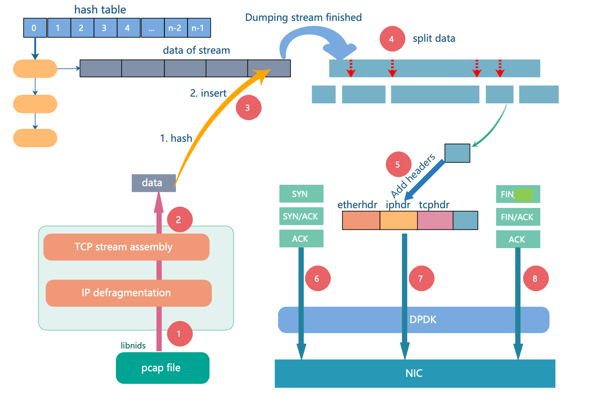

## streamGen

TCP stream generator



### Files

./   
 |__ main.c   
 |__ stream_gen.c   
 |__ string_matcher.c    
 |__ include/   
 |__ libnids-1.24/   
 |__ pcapfiles/  
 |__ Makefile   
 |__ setup.sh   
 |__ Run.sh   

### Dependency

Intel-DPDK  
libpcap  
libnet  
libnids  
numa-devel  
gmp-devel

### Build

1. Set environment variables

Before building streamGen, you need to compile and deploy [DPDK](https://github.com/DPDK/dpdk) first. 

```bash
$ export RTE_SDK=<path-to-dpdk>
$ export RTE_TARGET=x86_64-native-linuxapp-gcc
```


2. Compile

```bash
$ cd <path-to-streamGen>
$ cd libnids-1.24/
$ make
$ make install
$ cd ..
$ make
Binary file will be generated in build/
```

### Run

You may run "sudo ./build/streamGen -c 0x1 -n 1 -- -h" for help information.

To start streamGen, you need to give a pcap file as input, for example,

```bash
$ sudo ./build/streamGen -c 0x1 -n 1 -- -i pcapfiles/sample.pcap -o 0 -c 1000 - r 10
```

```bash
-c <core_mask>		: Core mask. (Options needed by DPDK)
-n <channels>		: Number of memory channel. (Options needed by DPDK)
-i <pcap file>		: Input file which provides network trace.
-o <interface>		: Interface used to send packets.
					(e.g. 1 for port1 with DPDK, eth1 for libpcap, default 0)
-c <concurrency>	: Concurrency when simulating TCP streams. (default 10)  
-b <burst>		: Parameter delivered to 'burst' in rte_eth_tx_burst. (default 1)
-r <fragment rate>	: Rate(x100) of fragmented packets (default 100, that is, 100%) 
```

### To display statistics during run time

```bash
1. Uncomment "LIBS_CFLAGS += -DSTAT_THREAD" in Makefile
2. Rebuild project
```

### To enable out-of-order generation
```bash
1. Uncomment "LIBS_CFLAGS += -DOOO_SEND" in Makefile
2. Rebuild project
```

### To enable Multi-threading mode

```bash
1. Uncomment "LIBS_CFLAGS += -DSEND_THREAD" in Makefile
2. Rebuild project
```

### To simulate SYN flood

```bash
$ ./build/streamGen -c 0x1 -n 1 -- -i pcapfils/xx.pcap -o 0 -m 2
(-m : Running mode, default 1 for normal stream generation mode. 2 is given here for simulating SYN flood)
```

### To dump stream data into seperate files during generation process 

```bash
1. Uncomment "#LIBS_CFLAGS += -DDUMP_PAYLOAD" in Makefile
2. Rebuild and Run 
3. Stream data will dumped in files/ 
```

### To enable pdump-dpdk
```bash
1. Uncomment "LIBS_CFLAGS += -DUSE_PDUMP" in Makefile
2. Rebuild project
```

### Q&A
